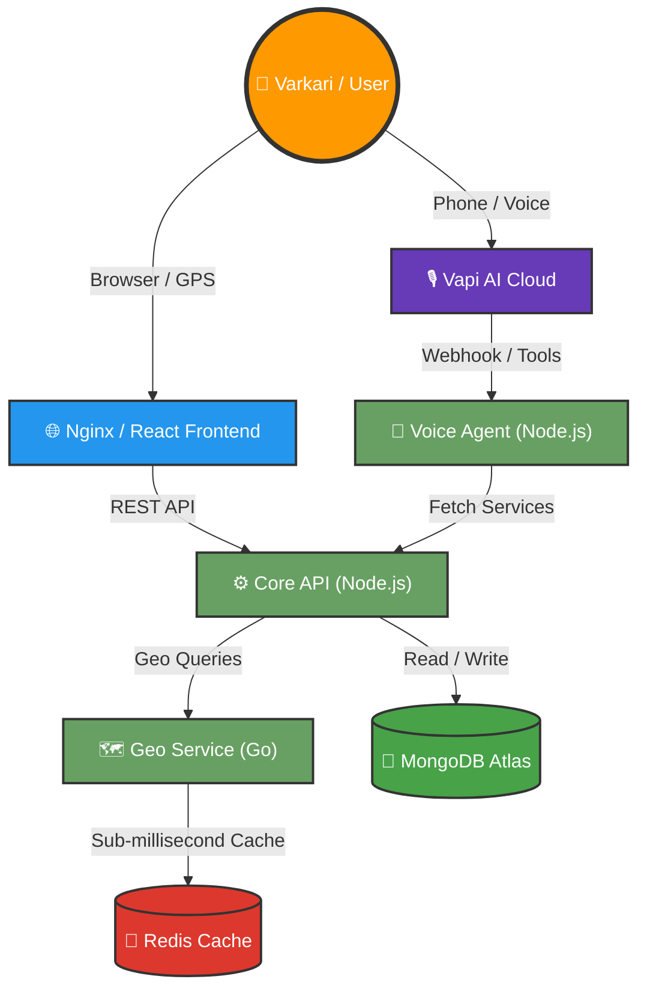

<div align="center">
  


<a href="https://github.com/Pruthviraj141/WariMitra">
  
</a>


<p align="center">
  
  
  
  
</p>

---

### 🌟 *The Future of Pilgrimage Safety & Assistance* 🌟
Visava (WariMitra) is a next-generation, highly scalable **Microservices Platform** designed to save lives and provide real-time assistance during massive pilgrimages. Powered by state-of-the-art **Conversational AI**, it allows users to find shelters, medical camps, and report missing persons entirely hands-free in multiple languages (Marathi, English).

---

</div>

<br>

<div align="center">
  <h2>🚀 Supercharged Tech Stack</h2>
  <p>Engineered for massive scale, real-time latency, and uncompromised reliability.</p>
  
</div>

<br>

---

## 🔥 Key Features

<table align="center">
  <tr>
    <td align="center" width="50%">
      <br>
      <b>🎙️ Conversational AI Agent</b><br>
      <i>Hands-free Vapi AI integration offering sub-second response times in native Marathi.</i>
    </td>
    <td align="center" width="50%">
      <br>
      <b>🗺️ Live Geolocation Tracking</b><br>
      <i>React + Leaflet maps rendering real-time shelters, medical camps, and safe zones.</i>
    </td>
  </tr>
  <tr>
    <td align="center" width="50%">
      <br>
      <b>⚡ Go-Powered Geo-Service</b><br>
      <i>Lightning-fast geospatial querying backed by Redis caching for immediate lookups.</i>
    </td>
    <td align="center" width="50%">
      <br>
      <b>🚨 Emergency Broadcast System</b><br>
      <i>Instant missing-person reporting that broadcasts to all volunteers in the network.</i>
    </td>
  </tr>
</table>

---

## 🏗️ System Architecture

Visava is built on a professional, loosely-coupled microservices architecture designed for high availability on AWS.



---

## 🚀 Quick Start (Dockerized)

Getting Visava running is literally a single command thanks to our fully containerized Docker architecture.

<details>
<summary><b>🛠️ Click to reveal Setup Instructions</b></summary>

### 1. Clone & Configure
```bash
git clone https://github.com/Pruthviraj141/WariMitra.git Visava
cd Visava

# Copy environment files
cp core-api/.env.example core-api/.env
cp voice-agent/.env.example voice-agent/.env
```

### 2. Launch the Ecosystem
```bash
docker compose up -d --build
```

**That's it! Your services are live:**
*   🌐 **Frontend**: `http://localhost:80`
*   ⚙️ **Core API**: `http://localhost:3000`
*   🗺️ **Geo Service**: `http://localhost:8081`
*   🤖 **Voice Agent**: `http://localhost:4000`

</details>

---

## 🔮 Future Scope & Roadmap

We are constantly pushing the boundaries of what is possible in disaster-management and pilgrimage tech.

| Phase | Milestone | Status | Description |
| :---: | :--- | :---: | :--- |
| **I** | **Microservices Foundation & Voice AI** | 🟢 Done | Vapi AI integration, Node/Go split, Dockerization, AWS CI/CD. |
| **II** | **Offline Mesh Networks** | 🟡 IP | Allow Varkaris to communicate without internet using Bluetooth mesh algorithms. |
| **III** | **Predictive Crowd Control** | 🔴 Planned | AI modeling using historical data to predict stampedes and dynamically reroute crowds. |
| **IV** | **Drone Medical Delivery** | 🔴 Planned | Automated dispatch of emergency medical supplies to exact GPS coordinates via drones. |

---

## 🤝 Contributing

We welcome PRs from developers of all skill levels! If you want to help save lives using code, check out our issues tab.

1. Fork the Project
2. Create your Feature Branch (`git checkout -b feature/AmazingFeature`)
3. Commit your Changes (`git commit -m 'Add some AmazingFeature'`)
4. Push to the Branch (`git push origin feature/AmazingFeature`)
5. Open a Pull Request

---

<div align="center">
  <b>Built with ❤️ for the Varkari Community</b>
  <br><br>
  
</div>
