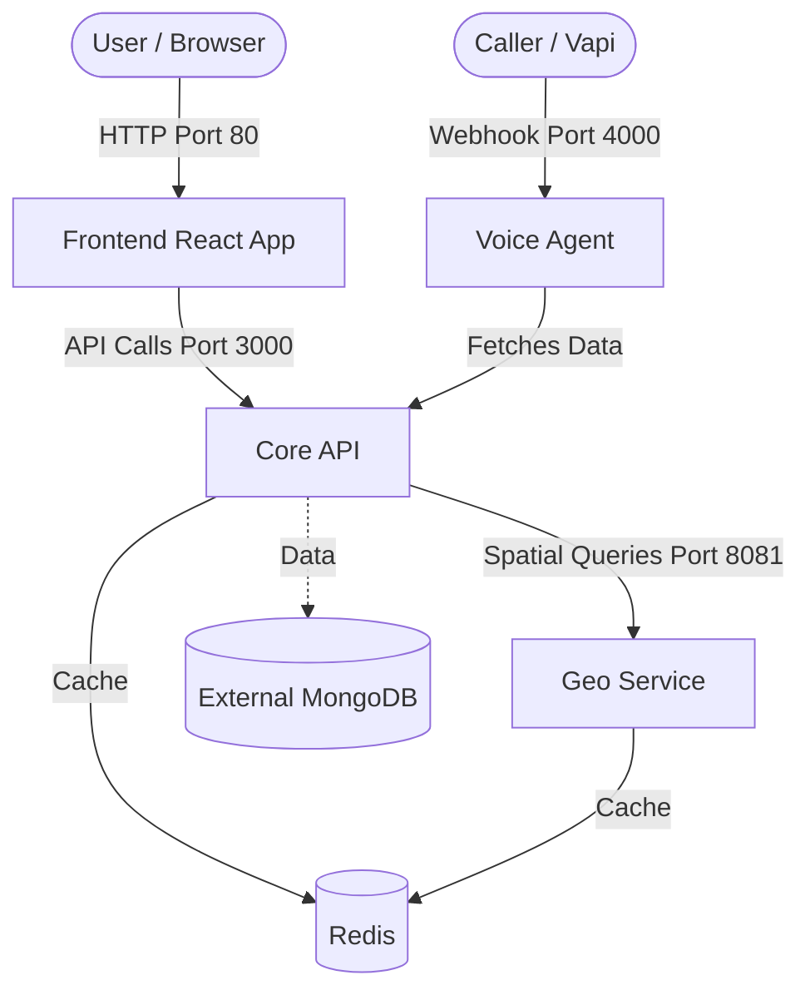

---
# CSS Styling for the PDF
margin: 2cm
background: "#f8f9fa"
---

<style>
  body {
    font-family: 'Inter', 'Segoe UI', Tahoma, Geneva, Verdana, sans-serif;
    color: #333;
    line-height: 1.6;
  }
  h1 {
    color: #2c3e50;
    text-align: center;
    font-size: 3em;
    margin-bottom: 0.2em;
    background: -webkit-linear-gradient(45deg, #3498db, #8e44ad);
    -webkit-background-clip: text;
    -webkit-text-fill-color: transparent;
  }
  h2 {
    color: #2980b9;
    border-bottom: 2px solid #3498db;
    padding-bottom: 5px;
    margin-top: 1.5em;
  }
  h3 {
    color: #8e44ad;
  }
  .hero-image {
    width: 100%;
    border-radius: 12px;
    box-shadow: 0 4px 15px rgba(0,0,0,0.1);
    margin: 20px 0;
  }
  .info-box {
    background: #eaf2f8;
    border-left: 5px solid #3498db;
    padding: 15px;
    border-radius: 4px;
    margin: 15px 0;
  }
  .warning-box {
    background: #fcf3cf;
    border-left: 5px solid #f1c40f;
    padding: 15px;
    border-radius: 4px;
    margin: 15px 0;
  }
  code {
    background: #2c3e50;
    color: #ecf0f1;
    padding: 2px 6px;
    border-radius: 4px;
  }
  pre {
    background: #2c3e50;
    color: #ecf0f1;
    padding: 15px;
    border-radius: 8px;
    overflow-x: auto;
  }
</style>

# Visava: The Masterclass
**A Complete Guide to Architecture, Docker, and Kubernetes Deployment**


<div class="info-box">
<strong>Welcome!</strong> This document is designed to teach you the entire architecture of the Visava project, why certain tools are used, and how to take this project from a local machine into a production cloud environment.
</div>

---

## 1. Project Anatomy: What is Where?

The Visava project uses a **Microservices Architecture**. Instead of one massive application, the system is broken down into smaller, specialized services that communicate with each other.

### Directory Breakdown

*   `frontend/`: The User Interface. Built with React. This is what the end-users and helpers interact with in their browser.
*   `core-api/`: The Brain. Built with Node.js/TypeScript. It handles user authentication, connects to MongoDB, and processes the main business logic (like handling Missing Person reports).
*   `geo-service/`: The Map Engine. A specialized service just for handling location data, nearest camp lookups, and spatial queries.
*   `voice-agent/`: The AI Communicator. This service talks directly to **Vapi**. It receives Webhooks when a user calls the phone number, processes the request, and tells the AI what to say next based on data from the `core-api`.
*   `docker-compose.yml`: The Conductor. This file tells your computer how to run all of the above services simultaneously on a single virtual network.

### Architecture Diagram



---

## 2. The Docker Masterclass

### Why do we use Docker in the Industry?
Before Docker, "It works on my machine" was the biggest problem in software. You might have Node.js version 22 installed, but the server has version 14. 


### Docker Image vs. Docker Container
It is very common to confuse "Image" and "Container", but the difference is critical:
*   **The Docker Image:** Think of this as a **blueprint** or a **recipe**. It is a static, read-only file that contains your source code, libraries, dependencies, tools, and other files needed for an application to run. When we write a `Dockerfile`, we are writing instructions on how to build this Image.
*   **The Docker Container:** Think of this as the **house** built from the blueprint, or a **running process**. When you take an Image and start it up, it becomes a Container. You can start *multiple* Containers from the *same* single Image (like building 10 identical houses from 1 blueprint). 

**Docker wraps your code AND the exact environment it needs into an Image, and runs it as a Container.**
*   **Consistency:** If the Image runs as a Container on your laptop, it will run exactly the same way on AWS.
*   **Isolation:** If the `geo-service` Container crashes, it won't take down the `core-api` Container.
*   **Speed:** Containers start in milliseconds compared to traditional Virtual Machines because they don't need to boot up a whole operating system.
### How Visava uses Docker (Multi-Stage Builds)
Your project uses an advanced technique called **Multi-Stage Builds**. We have **4 specific Dockerfiles** in this project, one for each major service. Let's break down how they work:

#### 1. Node.js Backend Services (`core-api` & `voice-agent`)
Both of these services use a very similar two-stage approach to ensure the final image is fast and secure.
*   **Stage 1 (The Builder):** We start with `node:22-alpine` (a tiny Linux version with Node.js). We copy the `package.json` and run `npm ci` to install ALL dependencies. Then, we copy our TypeScript code and run `npx tsc` to compile it into plain JavaScript.
*   **Stage 2 (The Production Image):** We start fresh with a new `node:22-alpine` image. We only install *production* dependencies (no heavy dev-tools). Then, we copy *only* the compiled `/dist` folder from Stage 1. 
*   **Security:** We switch to the `node` user (a non-root user) before running the app. This is a critical security best practice!

#### 2. Golang Service (`geo-service`)
Go is a compiled language, which makes it perfect for Docker.
*   **Stage 1 (The Builder):** We use `golang:1.22-alpine` to download our Go modules and run the `go build` command. This produces a single, self-contained executable file.
*   **Stage 2 (The Production Image):** We start with `alpine:3.19` (an incredibly tiny base OS). We copy *only* the single executable file from Stage 1. We create a custom `appuser` so it doesn't run as root, and then we run the executable. The final image size is only a few megabytes!

#### 3. React Frontend (`frontend`)
The frontend is different because it doesn't need Node.js to run in production; it just needs a web server to serve static HTML, CSS, and JS files.
*   **Stage 1 (The Builder):** We use Node.js to install dependencies and run `npm run build`. This bundles our React app into a static `/dist` folder.
*   **Stage 2 (The Nginx Server):** We use `nginx:alpine` (a high-performance web server). We copy the static files from Stage 1 into Nginx's HTML folder (`/usr/share/nginx/html`). Nginx is then configured to serve these files on Port 80.

#### 4. The Orchestrator (`docker-compose.yml`)
Having 4 Dockerfiles is great, but starting them manually is hard. `docker-compose.yml` solves this. 
*   It defines all our **services** (`core-api`, `geo-service`, `voice-agent`, `frontend`, and a `redis` database).
*   It creates a **private network** (`visava-network`) so they can talk to each other securely (e.g., `core-api` can reach `redis` just by connecting to the hostname `redis`).
*   It maps **ports** so you can access them from your browser.
*   It sets **environment variables** automatically.

### The Ngrok Transition
Currently, you use `ngrok`. Why? Because Vapi is on the public internet, and your laptop is hidden behind a router. Ngrok creates a tunnel so Vapi can reach your local `voice-agent`.

<div class="warning-box">
<strong>Production Deployment Rule:</strong> You NEVER use ngrok in production.
</div>

When we deploy to AWS (EC2), the server will have a **Public IP Address** (e.g., `54.123.45.67`). 
We will simply go to the Vapi Dashboard and change the Webhook URL from `https://xyz.ngrok.app` to `http://54.123.45.67:4000`. 

---

## 3. How to Make Visava Deployable (AWS EC2)

To take this project live, we don't need complex Kubernetes yet. A single AWS EC2 server running Docker Compose is perfect for this stage. Here is the exact roadmap to make this project deployable:

### Step 1: Provision an AWS EC2 Instance
1. Go to AWS and launch an **EC2 Instance** (Ubuntu 24.04 LTS is recommended).
2. Choose a size like `t3.medium` (since we are running 4 services + Redis).
3. **Security Groups:** Open ports `80` (Frontend), `3000` (Core API, optional), `4000` (Voice Agent Webhook), and `22` (SSH).

### Step 2: Prepare the Server
Connect to your EC2 instance via SSH and install Docker:
```bash
sudo apt update
sudo apt install docker.io docker-compose-v2 git -y
```

### Step 3: Configure Environment Variables
In development, you use local `.env` files. In production, you must create production versions of these files on the server.
*   Your `core-api` needs the production MongoDB URI.
*   Your `voice-agent` needs the `CORE_API_URL` set to the Docker internal network (`http://core-api:3000`), which is already handled in `docker-compose.yml`.

### Step 4: Transfer Code and Deploy
You have two options for getting code to the server:
*   **Method A (Simple):** `git clone` your repository directly onto the EC2 server, then run `sudo docker compose up -d --build`. This will build all 4 Dockerfiles directly on the server.
*   **Method B (Professional CI/CD):** Use GitHub Actions to build the Docker images, push them to a registry (like Docker Hub), and have the EC2 server pull the pre-built images.

For now, **Method A** is the fastest way to get deployable! Once you run `docker compose up -d`, Docker will build your Node, Go, and React images, link them together via the private network, and your app will be live on the EC2's public IP address.

---

## 4. The Professional Standard: How the Industry Treats Images

If you want to treat your Docker Images the "correct, professional way" (Method B), here are the golden rules of the industry:

### 1. Images are "Immutable" (Unchangeable)
Professionals **never** SSH into a server and change code manually (like editing a `.js` file). If a bug needs fixing, you change the code on your laptop, build a brand new Image, and replace the old Container with the new one. This guarantees the server always matches the code in GitHub exactly.

### 2. We use "Container Registries" (Like GitHub for Docker)
In a professional setup, your AWS EC2 server **does not build** the images. Building takes a lot of CPU power. Instead:
1. You push your code to GitHub.
2. A system like **GitHub Actions** (CI/CD) automatically runs `docker build` to create the Image.
3. GitHub Actions pushes that compiled Image to a **Registry** (like Docker Hub or AWS ECR).
4. Your EC2 server simply downloads the pre-built Image and runs it.

### 3. Version Tagging
Never use the `:latest` tag in production! Professionals tag images with versions (e.g., `visava-core-api:v1.2.0`). If `v1.2.0` crashes the server, you can instantly tell Docker to run `visava-core-api:v1.1.9` and your site is fixed in seconds.

---

## 5. Solving the Localhost vs. Production Problem

A major concern for developers is: *"If I hardcode `http://localhost:3000` in my React app to talk to my API, I will have to rewrite the code to point to my AWS IP when I deploy. But then when I develop locally again, I have to change it back! What a headache!"*

**The Industry Solution: Environment Variables (`.env`)**

Professionals **never** hardcode URLs in their code. Instead, we use Environment Variables. This is one of the core principles of the "12-Factor App" methodology.

### How it Works:
1. **In your React Code:** Instead of writing `fetch("http://localhost:3000/reports")`, you write `fetch(import.meta.env.VITE_API_URL + "/reports")`.
2. **On your Local Laptop:** You create a file called `.env.local` that contains:
   `VITE_API_URL=http://localhost:3000`
   Now, when you run `npm run dev` on your laptop, React automatically uses the localhost URL.
3. **On your AWS Server:** When GitHub Actions builds your Docker Image for production, or when you run it on AWS, you provide a different `.env` file (or pass the variable through Docker) that contains:
   `VITE_API_URL=http://54.123.45.67:3000`

### The Magic Result
Your source code **never changes**. You never have to manually edit files or switch branches. The exact same code simply reads its surroundings to figure out where it is (local vs. production) and behaves perfectly in both places!

---

## 6. How to Write Dockerfiles and Compose Files (and What is the Daemon?)

Since you have the `core-api/Dockerfile` open right now, let's use it to understand how to actually write these files from scratch, and understand what is doing the heavy lifting in the background.

### What is the Docker Daemon?

When you run a command like `docker build` or `docker compose up`, the command line program doesn't actually build the containers itself. Instead, it sends a message to the **Docker Daemon** (often called `dockerd`).
*   **The Daemon** is a background service (a long-running process) running on your computer (or server). 
*   It is the true "engine" of Docker. It handles the heavy lifting: downloading base images from the internet, managing networking, allocating RAM/CPU, and actually constructing and running the containers. 
*   When we say "Docker is running in the background", we mean the Daemon is running.

### How to Write a `Dockerfile`

A Dockerfile is just a list of instructions read from top to bottom. Let's look at the instructions used in your `core-api` Dockerfile:

*   **`FROM`**: This is always the first line. It tells the Daemon what your starting point is. E.g., `FROM node:22-alpine` means "Start with a tiny Linux computer that already has Node.js v22 installed."
*   **`WORKDIR`**: This creates a folder inside the container and navigates into it. E.g., `WORKDIR /app` means "Everything I do from now on happens inside the `/app` folder."
*   **`COPY`**: This copies files from your laptop into the container. E.g., `COPY package.json ./` means "Copy package.json from my laptop into the current folder (`/app`) inside the container."
*   **`RUN`**: This tells the Daemon to run a terminal command *while building the Image*. E.g., `RUN npm install` or `RUN npx tsc`. 
*   **`EXPOSE`**: This is documentation. It tells other developers (and Docker) which network port this container intends to listen on. E.g., `EXPOSE 3000`.
*   **`CMD`**: This is always the last line. While `RUN` executes commands *during the build process*, `CMD` specifies the command to run **when the Container finally starts up**. E.g., `CMD ["node", "dist/index.js"]`.

### How to Write `docker-compose.yml`

If a Dockerfile builds a single house, `docker-compose.yml` is the city planner that builds an entire neighborhood and wires up the roads between the houses. It uses YAML, a language that relies heavily on spaces (indentation) to show structure.

Here is a simplified example of how you write one:
```yaml
services: # 1. Declare that we are defining the containers we want to run
  core-api: # 2. Name your first container
    build: # 3. Tell Compose where to find the Dockerfile to build it
      context: ./core-api
    ports: # 4. Map ports (LaptopPort : ContainerPort)
      - "3000:3000"
    environment: # 5. Inject Environment Variables
      - MONGO_URL=mongodb://localhost:27017

  frontend: # 6. Name your second container
    build:
      context: ./frontend
    ports:
      - "80:80"
    depends_on: # 7. Tell Compose "Don't start the frontend until core-api is running!"
      - core-api
```

---

## 7. The Ultimate CI/CD Pipeline (GitHub Actions)

Your repository now has a file at `.github/workflows/deploy.yml`. This file completely automates your deployment to AWS. Every time you merge code into your `main` branch, GitHub will:
1. Log into your EC2 server securely.
2. Pull the latest code.
3. Generate your `.env` files dynamically (so your secrets stay off GitHub).
4. Run `docker compose up -d --build` to safely swap out the old containers for the new ones.

### Setup Instructions for CI/CD

To make this magic work, you must add the following **Repository Secrets** to your GitHub repository (Go to Settings -> Secrets and variables -> Actions -> New repository secret):

1. **`EC2_HOST`**: The Public IP address of your AWS server (e.g., `54.123.45.67`).
2. **`EC2_USERNAME`**: The username to log in (usually `ubuntu` for AWS Ubuntu servers).
3. **`EC2_SSH_KEY`**: The raw text of your `.pem` private key file.
4. **`PROD_VITE_API_URL`**: Your production frontend API path (e.g., `http://54.123.45.67:3000/api/v1`).
5. **`PROD_PUBLIC_URL`**: Your server's public IP (e.g., `http://54.123.45.67`). This replaces ngrok!
6. **`PROD_CORS_ORIGINS`**: The URLs allowed to talk to your backend (e.g., `http://54.123.45.67,http://localhost:5173`).
7. **`PROD_MONGODB_URI`**: The connection string to your production MongoDB Atlas cluster.
8. **`PROD_JWT_SECRET`**: A random secure string for user authentication tokens.
9. **`PROD_INTERNAL_API_KEY`**: The secret token shared between your core-api and voice-agent.
10. **`PROD_GOOGLE_CLIENT_ID`**: Your Google OAuth Client ID for frontend login.
11. **`PROD_TWILIO_ACCOUNT_SID`** (Optional): Your Twilio SID for SMS.
12. **`PROD_TWILIO_AUTH_TOKEN`** (Optional): Your Twilio Auth Token.
13. **`PROD_TWILIO_VERIFY_SERVICE_SID`** (Optional): Your Twilio Verify SID.
14. **`PROD_VAPI_PUBLIC_KEY`**: Your Vapi Public Key.
15. **`PROD_VAPI_PRIVATE_KEY`**: Your Vapi Private Key.
16. **`PROD_CARTO_API_TOKEN`** (Optional): Token for Carto maps.
17. **`PROD_CARTO_MCP_URL`** (Optional): URL for Carto map service.

*Note: You must SSH into your EC2 instance ONE TIME manually to run `git clone` and set up the `~/Visava` folder before the automated pipeline can take over.*

---
<div class="info-box" style="text-align: center;">
<strong>Ready to Deploy?</strong><br>
We have mastered the architecture and the containers. When you are ready, we can SSH into a real server and run these exact commands!
</div>
